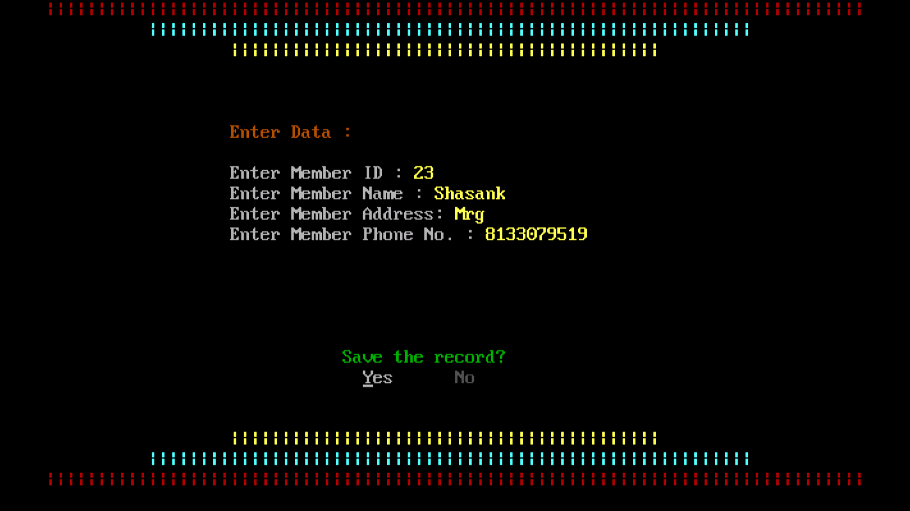

# Library-Management-System

### Description
• Digitally write the issues of book and calculate fines if someone takes it for more than 7 days. 
• You can add books, get details of it any time(total, in stock, trending). 
• The user can add the number of books. 
• The management allows to issue the book for 7 days without fine and thereafter takes fine for it. 
• The fines are calculated precisely keeping in mind leap years. 

### Features
• The environment is semi-graphical. Use keys to hover over the options. 
• Can calculate fines, number of days issued using built in Calendar 

### Tools required
• [Turbo C++](https://developerinsider.co/download-turbo-c-for-windows-7-8-8-1-and-windows-10-32-64-bit-full-screen/)

## Some Screenshots from the app

 
 

 
 

